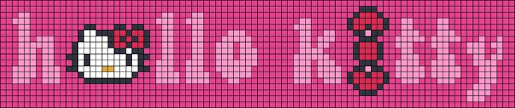

# 🌸 Hola, soy Yadhira 🌸
### 

*Apasionada por los datos, el diseño y el aprendizaje constante.*

---

## 👩‍💻 Sobre mí

Estudiante de Ingeniería de Sistemas con interés en análisis de datos. Aprendiendo de forma autodidacta Excel, SQL y Python, y explorando desarrollo web y UX/UI.

---

## 🛠️ Tecnologías

**📊 Datos & Análisis**

      

**💻 Desarrollo Web**

     

**🎨 UX/UI & Herramientas**

   

---

## 🌸 Hobbies & Intereses

---

## 📈 GitHub en números

<table>
  <tr>
    <td width="50%" align="center">
      
    </td>
    <td width="50%" align="center">
      
    </td>
  </tr>
  <tr>
    <td width="50%" align="center">
      
    </td>
    <td width="50%" align="center">
      
    </td>
  </tr>
</table>

---

✨ Diseñado y desarrollado por Yadhira Saavedra  

